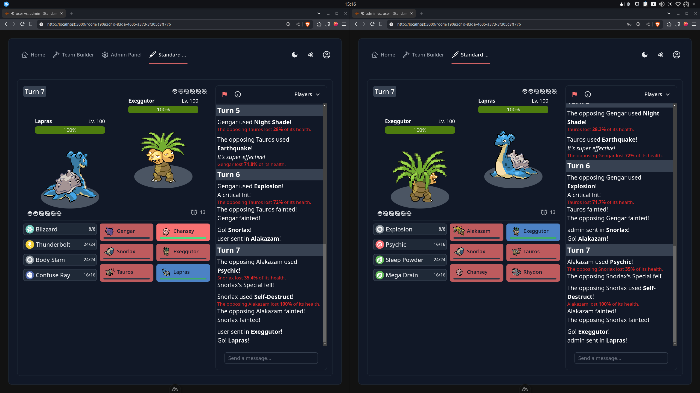

# Standoff

Standoff is a web-based Pokémon battle simulator for the Generation 1 (Pokémon Red, Blue, and Yellow) games.



## Setup

Prerequisites:
- pnpm
- postgres (only in production preview)

Before running the server, make sure to copy `.env.example` to `.env` and insert the appropriate values.

Install dependencies with pnpm:
```bash
# Install dependencies
pnpm install
```

Apply the database migrations with drizzle
```bash
pnpm drizzle-kit migrate
```

Start the development server on `http://localhost:3000`:
```bash
pnpm run dev
```
